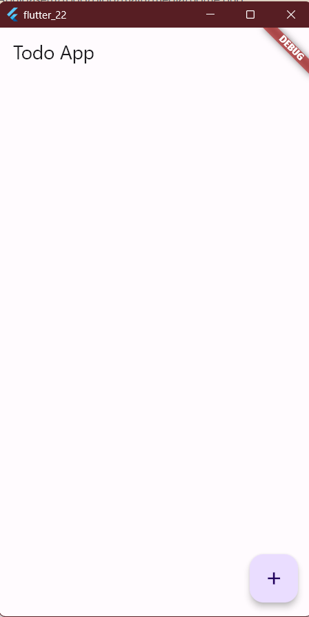
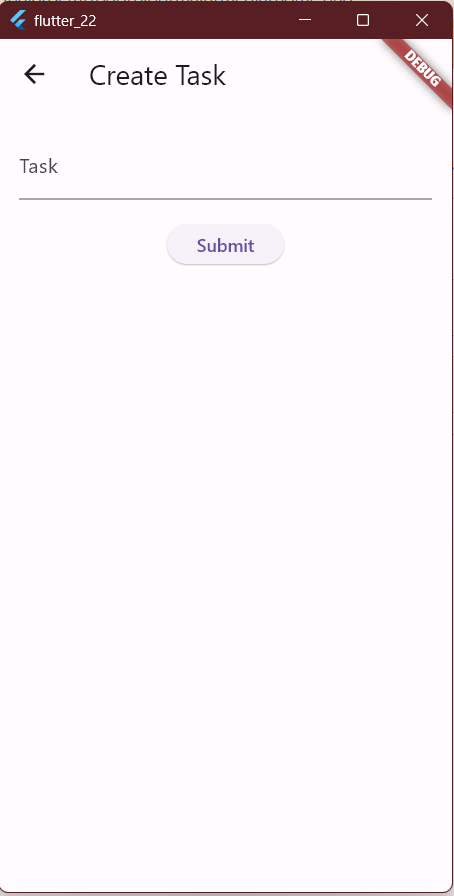

## Hints

I have included some hints here to help you with the assignment.
also if you have any questions submit an `issue` in this repo with a clear title and description for your question or if you're having issues implementing the requirements.

### Structure

#### 1. Home Page

* This is the structure of your home page and what widgets your required to implement.
you'll need to add a `FloatingActionButton` to the scaffold and in the on pressed you will navigate to `TaskPage` and capture the returned result from it.
* after storing the result update your UI.
* Check for the status change in the `CheckBox` widget and update your state accordingly.

### 2. Task Page
here you will capture the text from the `TextField` and pass it back to the `HomePage` when you click on the `Submit` button

### Flow

<video src='https://github.com/omaralmgerbie/flutter-labs/blob/main/assignment/todo/media/video.mp4' alt="Flow" width="200"/>

